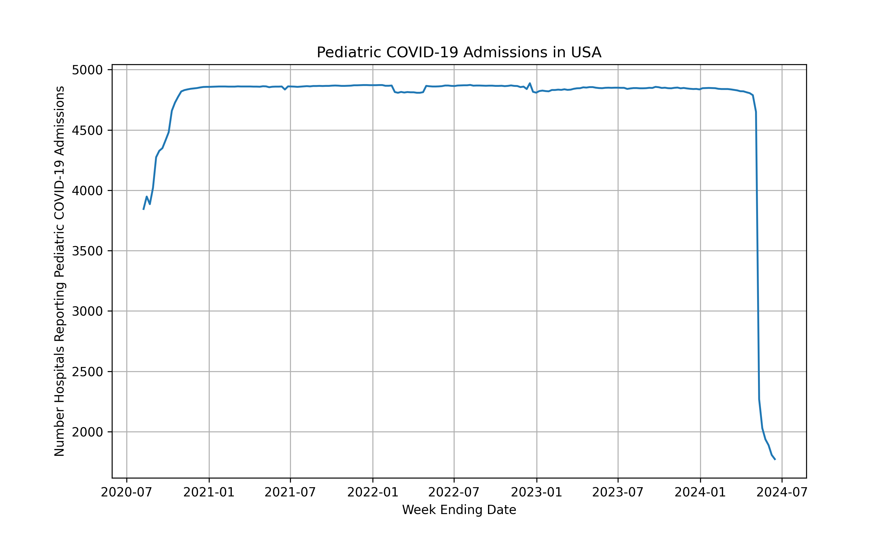

# pedhosp
This is under review.
<pre>
The goal of this program is to visualize the number of pedeatric COVID-19 admissions 
  from Aug 8, 2020 to June 15, 2024 in the US.
To install pedhosp,
$ pip install pedhosp
To displat a graph of the result, run the following command:
$ pedhosp
</pre>

